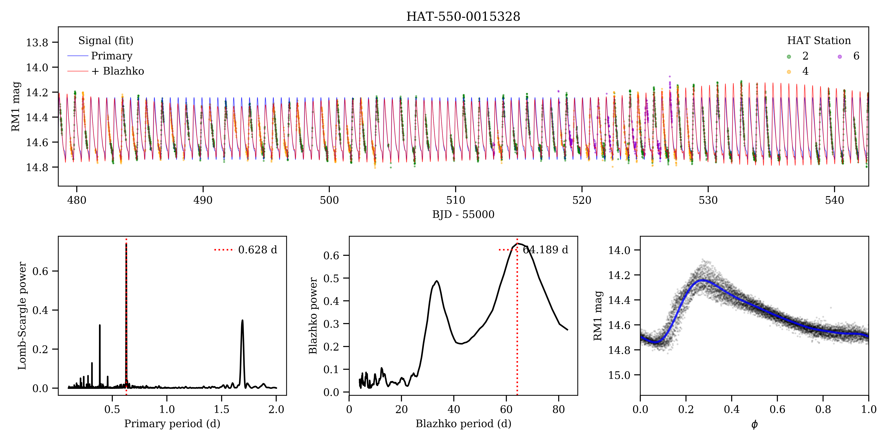

Blazhko periodogram and model
=============================

Small Python (3+) library for detecting and modeling the Blazhko effect in RR Lyrae.

## Installing

## Fitting a lightcurve

## Plotting utilities
